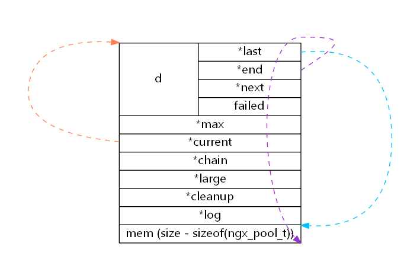
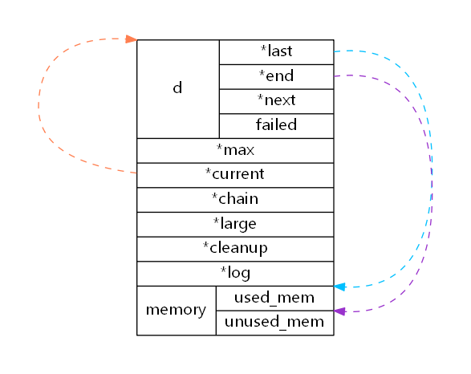
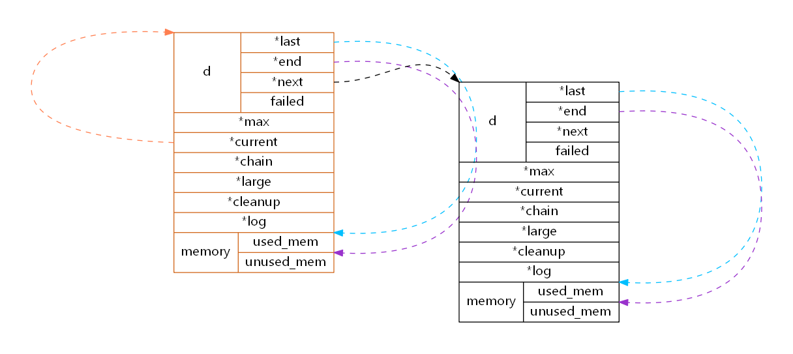
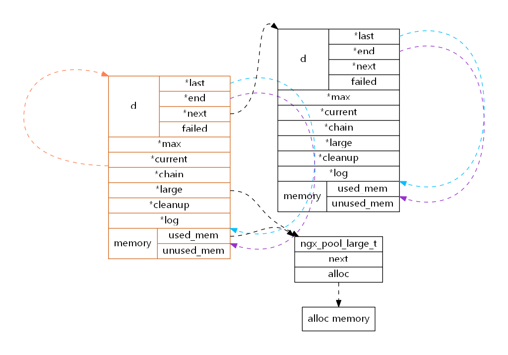
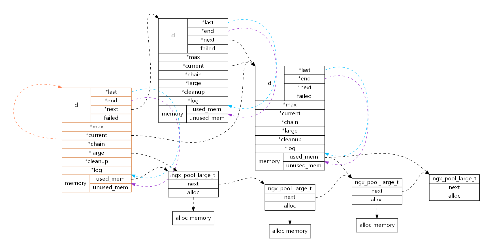

# nginx 内存池 ngx_pool_t

nginx 是自己实现了内存池的，所以在nginx ngx_pool_t 这个结构也随处可见，这里主要分析一下内存池的分配逻辑。

内存池实现了包括小块内存、大块内存和清理资源几种资源的处理，应该来说覆盖了绝大数的使用场景了。


## 相关结构定义

```c
// 大块内存
typedef struct ngx_pool_large_s  ngx_pool_large_t;
struct ngx_pool_large_s {
    ngx_pool_large_t     *next;         // 下一个大块内存池
    void                 *alloc;        // 实际分配内存
};

// 小块内存池
typedef struct {
    u_char               *last;         // 可分配内存起始地址
    u_char               *end;          // 可分配内存结束地址
    ngx_pool_t           *next;         // 指向内存管理结构
    ngx_uint_t            failed;       // 内存分配失败次数
} ngx_pool_data_t;

// 内存池管理结构
typedef struct ngx_pool_s            ngx_pool_t;
struct ngx_pool_s {
    ngx_pool_data_t       d;            // 小块内存池
    size_t                max;          // 小块内存最大的分配内存，评估大内存还是小块内存
    ngx_pool_t           *current;      // 当前开始分配的小块内存池
    ngx_chain_t          *chain;        // chain
    ngx_pool_large_t     *large;        // 大块内存
    ngx_pool_cleanup_t   *cleanup;      // 待清理资源
    ngx_log_t            *log;          // 日志对象
};
```


ngx_pool_t 是整个内存池的管理结构，这种结构对于个内存池对象来说可能存在多个，但是对于用户而言，第一下访问的始终是创建时返回的那个。多个 ngx_pool_t 通过 `d.next` 来进行连接，`current` 指向 当前开始分配的小块内存池，注意 ngx_pool_data_t 在内存池结构的起始处，可以进行类型转换访问到不同的成员。

## 实现

### 内存对齐

```c
#define ngx_align(d, a)     (((d) + (a - 1)) & ~(a - 1))
#define ngx_align_ptr(p, a)                                                   \
    (u_char *) (((uintptr_t) (p) + ((uintptr_t) a - 1)) & ~((uintptr_t) a - 1))
```
参考 [ngx_align 值对齐宏](https://www.cnblogs.com/shuqin/p/13832722.html) 分析，`ngx_align_ptr` 同理

### 创建内存池

max 的最大值为 4095，当从内存池中申请的内存大小大于 max 时，不会从小块内存中进行分配。

```c
ngx_uint_t  ngx_pagesize = getpagesize();  // Linux 上是 4096
#define NGX_POOL_ALIGNMENT 16
#define NGX_MAX_ALLOC_FROM_POOL  (ngx_pagesize - 1)  // 4095

ngx_pool_t *
ngx_create_pool(size_t size, ngx_log_t *log)
{
    ngx_pool_t  *p;

    p = ngx_memalign(NGX_POOL_ALIGNMENT, size, log);  // 16 字节对齐申请 size 大小的内存
    if (p == NULL) {
        return NULL;
    }

    p->d.last = (u_char *) p + sizeof(ngx_pool_t);  // 设置可分配内存的起始处
    p->d.end = (u_char *) p + size;                 // 设置可分配内存的终止处
    p->d.next = NULL;
    p->d.failed = 0;                                // 内存分配失败次数

    size = size - sizeof(ngx_pool_t);               // 设置小块内存可分配的最大值（小于 4095）
    p->max = (size < NGX_MAX_ALLOC_FROM_POOL) ? size : NGX_MAX_ALLOC_FROM_POOL;

    p->current = p;                                 // 设置起始分配内存池
    p->chain = NULL;
    p->large = NULL;
    p->cleanup = NULL;
    p->log = log;

    return p;
}
```

内存池创建后的结构逻辑如图所示：



### 内存申请

申请的内存块以 max 作为区分

```c
void *
ngx_palloc(ngx_pool_t *pool, size_t size)
{
#if !(NGX_DEBUG_PALLOC)
    if (size <= pool->max) {
        return ngx_palloc_small(pool, size, 1);
    }
#endif

    return ngx_palloc_large(pool, size);
}
```

#### 小块内存申请

current 指向每次申请内存时开始检索分配的小块内存池，而 ngx_palloc_small 的参数 pool 在内存池没有回收时，是固定不变的。

```c
static ngx_inline void *
ngx_palloc_small(ngx_pool_t *pool, size_t size, ngx_uint_t align)
{
    u_char      *m;
    ngx_pool_t  *p;

    p = pool->current;  // 从 current 处开始分配合适的内存

    do {
        m = p->d.last;

        if (align) {  // 是否需要内存对齐
            m = ngx_align_ptr(m, NGX_ALIGNMENT);
        }

        // 当前小块内存池的剩余容量满足申请的内存
        if ((size_t) (p->d.end - m) >= size) {
            p->d.last = m + size;

            return m;  // 一旦满足分配直接退出
        }

        p = p->d.next;  // 不满足的情况下寻找下一个小块内存池

    } while (p);

    return ngx_palloc_block(pool, size); // 没有满足分配的内存池，再申请一个小块内存池
}
```

当在小块内存池中找到了合适的内存后的结构如下：



当没有小块内存池满足申请时，会再申请一个小块内存池来满足分配，在设置完 last 和 end 两个内存指示器后，对从 current 开始的内存池成员 failed 进行自增操作，并且当这个内存池的 failed 分配次数大于 4 时，表面这个内存分配失败的次数太多，根据经验应该下一次分配可能还是失败，所以直接跳过这个内存池，移动 current。

新的内存块插入至内存池链表的尾端。

```c
#define NGX_ALIGNMENT   sizeof(unsigned long)  // 8

static void *
ngx_palloc_block(ngx_pool_t *pool, size_t size)
{
    u_char      *m;
    size_t       psize;
    ngx_pool_t  *p, *new;

    psize = (size_t) (pool->d.end - (u_char *) pool);  // 每一个内存池的大小都相同

    m = ngx_memalign(NGX_POOL_ALIGNMENT, psize, pool->log);  // 16 字节对齐申请
    if (m == NULL) {
        return NULL;
    }

    new = (ngx_pool_t *) m;

    new->d.end = m + psize;
    new->d.next = NULL;
    new->d.failed = 0;

    m += sizeof(ngx_pool_data_t);
    m = ngx_align_ptr(m, NGX_ALIGNMENT);
    new->d.last = m + size;

    for (p = pool->current; p->d.next; p = p->d.next) {
        if (p->d.failed++ > 4) {
            pool->current = p->d.next;
        }
    }

    p->d.next = new;  // 尾插法插入至链表末端

    return m;
}
```

分配一块内存池后逻辑结构如下：


#### 大块内存申请

大块内存是通过 `large` 连接的，并且都属于 ngx_create_pool 返回的 ngx_pool_t 结构。malloc 分配的内存由一个 ngx_pool_large_t 节点来挂载，而这个 ngx_pool_large_t 节点又是从小块内存池中分配的。

- 为避免large链表长度过大导致在遍历寻找空闲挂载节点耗时过长，限制了遍历的节点为3，如果没有满足要求则直接分配
- 头插法 插入至large链表中，新的节点后面也是最先被访问

```c
static void *
ngx_palloc_large(ngx_pool_t *pool, size_t size)
{
    void              *p;
    ngx_uint_t         n;
    ngx_pool_large_t  *large;

    p = ngx_alloc(size, pool->log);  // 调用 malloc
    if (p == NULL) {
        return NULL;
    }

    n = 0;

    for (large = pool->large; large; large = large->next) {  // 从large 中链表中找到 alloc 为 NULL 的节点，将分配的内存挂在该节点上
        if (large->alloc == NULL) {
            large->alloc = p;
            return p;
        }

        if (n++ > 3) {  // 为了避免过多的遍历，限制次数为 0
            break;
        }
    }

    // 当遍历的 ngx_pool_large_t 节点中 alloc 都有指向的内存时，从小块内存中分配一个 ngx_pool_large_t 节点用于挂载新分配的大内存
    large = ngx_palloc_small(pool, sizeof(ngx_pool_large_t), 1);
    if (large == NULL) {
        ngx_free(p);
        return NULL;
    }

    large->alloc = p;
    large->next = pool->large;  // 头插法 插入至大块内存链表中
    pool->large = large;

    return p;
}
```

第一次大块内存分配后的结构如下：


### 完整内存池结构逻辑

- 所有的内存池结构都通过 d.next 连接
- 前两个内存池结构的 current 都指向第三个内存池结构
- 所有的 ngx_pool_large_t 节点都是从小内存池中分配的
- 所有的 ngx_pool_large_t 节点都是连接在首个内存池结构上的
- ngx_pool_large_t 节点的 alloc 被释放但 ngx_pool_large_t 节点不回收




## 总结

ngx_pool_t 内存分配方面
- 通过 current 和 d.next 来访问其他的内存池结构
- 插入方式
    - 小块内存池通过尾插法插入至内存池链表的尾端
    - 大块内存通过头插法插入至large链表的首部
- 限制次数
    - 小内存分配失败（failed）次数大于4次后就不再作为分配内存的池子了
    - 大内存只寻找 large 链表中前三节点是否可以挂载新分配的内存
- 内存对齐，多处内存对齐减少内存跨 cache 的数量

其实总体而言这是一个比较简单的内存池了，还是有一些内存浪费的地方，`限制次数` 可以说明这个情况，不过这也是在简单、高效和内存分配上的一个平衡了

